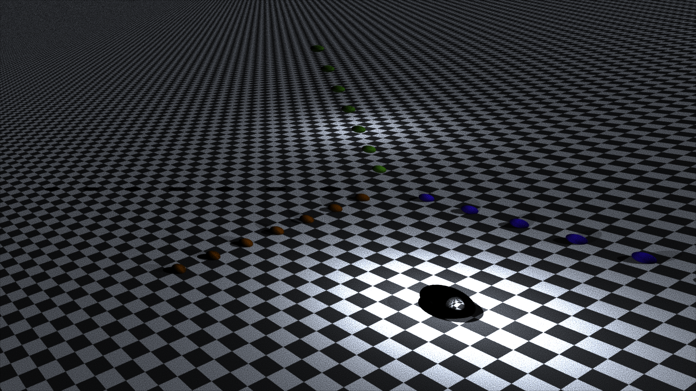

# go-pbrt
Phsically Based Ray Tracer written in Go, following the Physically Based Rendering book.


#### Run Service

```
go run ./cmd/pbrtd/*.go
```

#### Curl Render endpoint
Install [grpcurl](https://github.com/fullstorydev/grpcurl)
```
grpcurl -plaintext -d '{"width": 1920, "height": 1080}' localhost:3001 render.Render/Render
```

```json
{
  "path": "build/render-2018-12-17T20:25:39-05:00.png"
}
```


